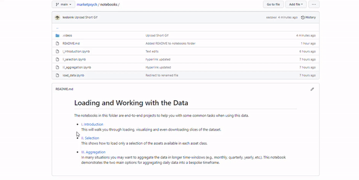

# Loading and Working with the Data

The notebooks in this folder are end-to-end projects to help you with some common tasks when using this data.

* [I. Introduction](https://github.com/marketpsych/marketpsych/blob/main/notebooks/i_introduction.ipynb)  
    This will walk you through loading, visualizing and even downloading slices of the dataset.

* [II. Selection](https://github.com/marketpsych/marketpsych/blob/main/notebooks/ii_selection.ipynb)  
    This shows how to load only a selection of the assets available in each asset class.

* [III. Aggregation](https://github.com/marketpsych/marketpsych/blob/main/notebooks/iii_aggregation.ipynb)  
    In many situations you may want to aggregate the data in longer time-windows (e.g., monthly, quarterly, yearly, etc.). This notebook demonstrates the two main options for aggregating daily data into a bespoke timeframe.

To get started, click on the first [link](https://github.com/marketpsych/marketpsych/blob/main/notebooks/i_introduction.ipynb). You'll be lead to a preview of the notebook. Next, click on the <kbd>Open in Colab</kbd> icon at the top of the preview. This will open the notebook in Colab. The notebook is a tutorial in itself, thus please read the text and following the instructions. To run the cells, you need to click on the play button or to use <kbd>Control</kbd>+<kbd>Shift</kbd> (<kbd>Command</kbd>+<kbd>Shift</kbd> on Mac). When running the first cell, a Warning will be given, click on `Run anyway`. The GIF below displays the steps.

